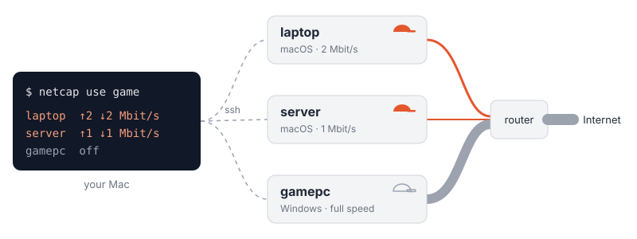

<p align="center">
  
</p>

<p align="center">
  <a href="https://github.com/ken-ty/netcap/tags"></a>
  <a href="LICENSE"></a>
  
  
</p>

<p align="center">
  <a href="README.md">English</a> · 日本語
</p>

同じ回線を使う複数の端末の WAN 向け帯域を、1 台の Mac から 1 コマンドで絞る / 戻す CLI。
ルーターで帯域を制御できない回線でも、端末の側で上限をかけられる。

<p align="center">
  
</p>

- 絞るのはインターネットとの通信だけ。同じ LAN の機器どうしの通信は絞らない
- 例外として、インターネット宛てでも ping (ICMP) と DNS は絞らない。遅延の測定を歪めないため
- 端末へは ssh で頼み、許可は操作される側の `authorized_keys` が決める

## Quick Start

1. 操作する Mac に CLI を入れる (Python 3 だけで動く)

   ```bash
   brew tap ken-ty/netcap https://github.com/ken-ty/netcap
   brew install netcap
   ```

2. 絞られる各端末に端末側を root / 管理者で入れる (Windows は [docs/host-setup.md](docs/host-setup.md))

   ```bash
   sudo bash mac/install.sh --boot off
   ```

3. `~/.config/netcap/` に端末とプロファイルを書く (雛形は [examples/](examples/))

   ```text
   # hosts — 名前  OS  ssh の Host 名 (自分自身なら -)
   laptop   mac  -
   gamepc   win  gamepc

   # profiles — 名前  端末=上り/下り (Mbit/s) か off
   game    laptop=2/2  gamepc=off
   none    laptop=off  gamepc=off
   ```

4. 使う

   ```bash
   netcap use game      # プロファイルの組で全台を絞る
   netcap status all    # 各端末で実際にかかっている上限を読む
   netcap use none      # 全台を戻す
   ```

ssh 鍵の forced command の設定は [docs/host-setup.md](docs/host-setup.md#許可は操作される側が決める)、
書式の詳細は [docs/configuration.md](docs/configuration.md)。

## 対応 OS

| 役割 | macOS | Windows | Linux |
| --- | --- | --- | --- |
| 操作する側 (CLI) | ✅ | — | — |
| 操作される側 | ✅ 上り・下り (pf + dummynet) | ⚠️ 上りのみ (NetQosPolicy) | — |

## ユースケース

- **遅延を守る** — ゲームやビデオ会議の間、他の端末の大きなダウンロードで回線が詰まらないようにする
- **バックグラウンドの通信を抑える** — OS の更新、クラウド同期、バックアップが回線を使い切るのを防ぐ
- **容量に上限がある回線で使いすぎを防ぐ** — モバイル回線やテザリングで、端末ごとに上限をかける
- **細い回線を再現して試す** — アプリや配信が遅い回線でどう動くかを、実機で確かめる
- **時間帯で切り替える** — cron や launchd から `netcap use` を呼び、夜間だけ絞るといった運用にする

## 使い方

```text
netcap status [host|all] [--json]           実際にかかっている上限を読む
netcap get    [host|all] [--json]           設定 (既定値・起動時の挙動) を読む
netcap on     <host|all> [--up N --down N]  上限をかける (flag は今回だけ)
netcap off    <host|all>                    上限を外す (再起動で既定に戻る)
netcap set    <host|all> --up N --down N    既定を書き換える
netcap check  <host|all> [--json]           実測 (curl の上下 + ping)
netcap use    <profile>                     プロファイルを適用
netcap profiles                             プロファイル一覧
netcap --version
```

## ドキュメント

- [docs/host-setup.md](docs/host-setup.md) — 端末側のセットアップと許可
- [docs/configuration.md](docs/configuration.md) — 設定ファイルの書式
- [docs/design.md](docs/design.md) — 設計判断と実測
- [CONTRIBUTING.md](CONTRIBUTING.md) — 開発とリリース

## License

[MIT](LICENSE)
