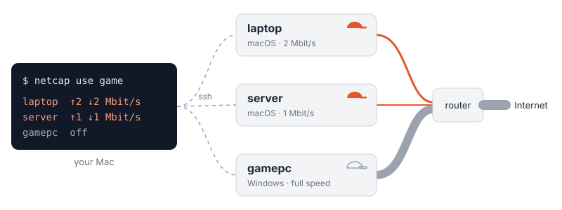

<p align="center">
  
</p>

<p align="center">
  <a href="https://github.com/ken-ty/netcap/tags"></a>
  <a href="LICENSE"></a>
  
  
</p>

<p align="center">
  English · <a href="README.ja.md">日本語</a>
</p>

**Host-based QoS — no QoS router needed.** A CLI that throttles the internet bandwidth of every computer on your network (macOS, Linux, Windows), from one of them, with one command.
Each device enforces its own cap, so the router you already have (even the one your ISP handed you) is fine.

<p align="center">
  
</p>

- Only internet traffic is capped. Traffic between devices on the same LAN is left alone
- ping (ICMP) and DNS are never capped, so latency measurements stay honest
- Commands reach each device over ssh; what is allowed is decided by that device's `authorized_keys`
- Unlike router QoS, it does not prioritize traffic. It caps the devices you choose, so the rest of the line stays free
- The same verbs on every OS, instead of pf + dummynet on macOS, `tc` on Linux, and NetQosPolicy on Windows
- Nothing keeps running on the devices: `netcap install` leaves small scripts that run only when netcap calls them.
  The OS scheduler runs one only to lift a cap at its `--for` deadline, and at boot with `--boot on`

## Quick Start

### 1. Install

```bash
brew tap ken-ty/netcap https://github.com/ken-ty/netcap
brew trust ken-ty/netcap   # Homebrew 7 and later load formulae only from trusted taps
brew install netcap
netcap install          # sets up this machine; asks for a name (Enter gives "me")
```

`netcap install` asks for your password once (sudo; on Windows, run it as Administrator). Needs only Python 3.
Homebrew before 7 has no `brew trust` and needs none: skip that line.
Without brew, see [docs/host-setup.md](docs/host-setup.md).

### 2. Try it on your own line

```bash
netcap on me --up 2 --down 2 --for 10m   # cap this machine to 2 Mbit/s for 10 minutes; it lifts itself after that
netcap status                            # read the cap actually in effect, and when it ends
netcap off me                            # remove it now
```

> **If you get stuck: `netcap off me` removes the cap.** It runs locally, so it works even when the line is too thin to load anything.
> If netcap itself does not run, call the device side directly:
>
> ```bash
> sudo /Library/PrivilegedHelperTools/netcap-netshape off          # macOS
> sudo /usr/libexec/netcap/netcap-netshape off                      # Linux
> ```
>
> ```powershell
> powershell -ExecutionPolicy Bypass -File C:\ProgramData\netcap\netshape.ps1 off   # Windows, as Administrator
> ```
>
> A reboot also clears the cap on macOS and Linux, unless the device was installed with `--boot on` (then the default cap
> comes back). Windows keeps it across reboots.

### 3. Manage other devices

Anything you can `ssh` into can be added. Pass its ssh destination (a Host from `~/.ssh/config` works):

```bash
netcap install --ssh gamepc     # installs the agent there; asks for a name (Enter gives "gamepc")
netcap status all
netcap on gamepc --up 5 --down 5
```

It copies the device side over, runs its installer (the device's sudo password, or an Administrator account on Windows),
and registers a netcap-only ssh key that can run nothing but netcap's verbs there.

To move several devices at once, write recipes (profiles) in `~/.config/netcap/profiles`:

```text
# name  device=up/down (Mbit/s) or off
game    me=2/2  gamepc=off
none    me=off  gamepc=off
```

```bash
netcap use game      # apply a recipe to its devices
netcap use game --for 2h   # the same; each device it caps lifts the cap by itself after 2 hours
netcap use none      # remove all caps
```

Or name only the device to protect: netcap caps every other one and measures it before and after.

```bash
netcap protect gamepc --up 2 --down 2             # cap everything but gamepc; show gamepc's check before and after
netcap protect gamepc --up 2 --down 2 --load 5    # the others also transfer 5 MB each meanwhile; says whether latency improved
netcap protect gamepc --up 2 --down 2 --for 1h    # the others lift their caps by themselves after an hour
netcap protect --off                              # put each device back as it was
```

Without `--load`, the difference shows only if the other devices happen to use the line during the measurement.
`--load` makes that traffic, so it costs data: about 4 × MB × the other devices (it says how much first).
The protected device itself transfers about 4 MB either way (1 MB up and 1 MB down, before and after).
A Windows device among the others is capped on upload only, unless it was installed with `--with-download`.

Rename a device with `netcap rename me laptop`; remove one with `netcap uninstall gamepc`.
For the file format, see [docs/configuration.md](docs/configuration.md); for what install sets up on a device, [docs/host-setup.md](docs/host-setup.md).

## Supported platforms

| Role | macOS | Linux | Windows |
| --- | --- | --- | --- |
| Controller (CLI) | ✅ | ✅ | ✅ |
| Capped device | ✅ up & down (pf + dummynet) | ✅ up & down (tc) | ⚠️ upload (NetQosPolicy); download only with `netcap install <name> --with-download` (WinDivert, x64) |

Feature by feature: [docs/platforms.md](docs/platforms.md).

## Use cases

- **Protect latency** — keep other devices' big downloads from choking games or video calls
- **Tame background traffic** — stop OS updates, cloud sync, and backups from eating the whole line
- **Stay within a data cap** — limit each device on mobile or tethered connections
- **Test on a slow network** — see how an app or stream behaves on a thin line, on real hardware
- **Schedule it** — call `netcap use` from cron or launchd, e.g. to cap only at night

## Usage

```text
netcap status [<host>|all] [--json]         read the cap actually in effect
netcap get    [<host>|all] [--json]         read the settings (default, boot behavior)
netcap on     <host>|all [--up N --down N] [--for 30m]  apply a cap (flags apply this time only; --for lifts it after that long)
netcap off    <host>|all                    remove the cap (with boot=on, the default comes back at reboot)
netcap set    <host>|all --up N --down N    change the default
netcap check  [<host>|all] [--bytes N] [--json]  measure (curl up/down + ping; --bytes: how much to transfer, up to 100 MB)
netcap use    <profile> [--for 30m]         apply a profile (--for: each device it caps lifts it after that long)
netcap profiles                             list profiles
netcap protect <host> [--up N --down N] [--load MB] [--for 30m]  cap every other device; show <host>'s check before and after
netcap protect --off                        put each device back as it was
netcap install [<name>] [--ssh DEST] [--boot on|off]  install the agent on a device and register it (--boot on: cap at boot)
netcap uninstall <host> [--config-only]     remove this controller's key and registration (the agent goes with the last)
netcap rename <old> <new>                   rename a device
netcap export                               print hosts and profiles as JSON (no keys)
netcap import <file|->                      read them back (--replace to overwrite)
netcap doctor [<host>|all] [--json]         check that each device's netcap key is pinned to its forced command
netcap <command> -v                         also show what the table leaves out (-vv: the raw output too)
netcap <command> -q                         print only the result: no progress, hints, or notes
netcap help [<command>|exit-codes]          the same help as -h; exit-codes lists what each exit status means
netcap completion bash|zsh                  print a completion script, e.g. eval "$(netcap completion zsh)"
netcap --version                            also -V, or netcap version
```

Values are Mbit/s and may be decimals. `0` is an error (nothing changes); to lift a cap, use `off`.
What happens on reboots, power loss, and with more than one controller: [docs/operations.md](docs/operations.md).

Help and error messages follow your locale (`LANG`); Japanese is available. `LC_ALL=C netcap -h` shows English.

For completion, add `eval "$(netcap completion bash)"` to `~/.bashrc`, or `eval "$(netcap completion zsh)"` to
`~/.zshrc` after `autoload -Uz compinit && compinit` (without it, zsh says `compdef: command not found`).

## Documentation

- [docs/why.md](docs/why.md) — compared with router QoS and other tools: when to choose netcap
- [docs/vision.md](docs/vision.md) — what netcap is for, where it is going, and what it will not do
- [docs/host-setup.md](docs/host-setup.md) — device setup and ssh permissions
- [docs/configuration.md](docs/configuration.md) — config file format
- [docs/operations.md](docs/operations.md) — reboots, power loss, more than one controller
- [docs/platforms.md](docs/platforms.md) — what each OS supports
- [docs/compatibility.md](docs/compatibility.md) — which agent versions each CLI release works with
- [docs/design.md](docs/design.md) — design decisions and measurements
- [SECURITY.md](SECURITY.md) — threat model and how to report a vulnerability
- [CHANGELOG.md](CHANGELOG.md) — what changed in each release
- [CONTRIBUTING.md](CONTRIBUTING.md) — development and releases

## License

[MIT](LICENSE)
